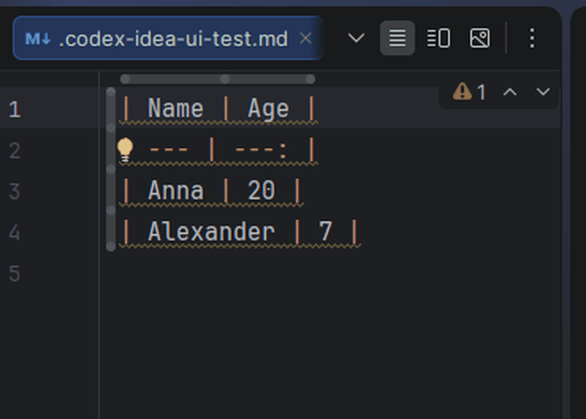

# Markdown Table Editor for JetBrains IDEs

[](https://github.com/krotname/IdeaMarkdownTableEditor/actions/workflows/ci.yml)
[](https://github.com/krotname/IdeaMarkdownTableEditor/releases/latest)
[](build.gradle.kts)
[](https://plugins.jetbrains.com/plugin/32159-markdown-table-editor)
[](https://plugins.jetbrains.com/plugin/32159-markdown-table-editor)
[](https://markdowntableeditor.krot.name/)
[](LICENSE)

Markdown Table Editor turns JetBrains IDEs on the IntelliJ Platform into convenient Markdown table editors.
Paste a messy table from someone else or from an AI tool, press `Tab`, and the plugin aligns the columns, preserves Markdown formatting,
and helps you quickly rearrange rows, columns, and data directly in the IDE.

## Related Projects

- Notepad++ version: [NppMarkdownTableEditor](https://github.com/krotname/NppMarkdownTableEditor)

## Demo



The GIF is built from real JetBrains IDE screenshots on Windows: a regular `.md` file is open, and the `Align Table` command is triggered with `Ctrl+Alt+Shift+1`.

## Why Use It

- You do not need to leave your JetBrains IDE for a separate Markdown editor just to fix tables.
- Large pipe tables stay readable as plain text.
- `Tab`, sorting, and row or column operations save manual spacing work.
- CSV/TSV text can be converted into a clean Markdown table quickly.
- Commands are available from the `Tools` menu, the editor context menu, and IDE action search.
- Action names, dialogs, and messages are localized for popular IDE locales.

## Features

- `Tab` inside a Markdown table aligns the table.
- Outside Markdown tables, `Tab` keeps working as the normal IDE indent action.
- Align the table around the caret.
- Move to the next or previous cell.
- Insert, delete, and move rows.
- Insert, delete, and move columns.
- Sort rows by the current column in ascending or descending order.
- Convert selected CSV/TSV text or the current CSV/TSV block into a Markdown table.
- CSV/TSV block detection ignores commas inside quotes and does not capture adjacent plain text.
- Insert a new table with a selected number of columns and rows.
- Preserve Markdown alignment markers: `---`, `:---`, `---:`, `:---:`.
- Correctly handle escaped pipes: `\|`.
- Large-table operations are optimized and guarded by dedicated CI performance benchmarks.

## Installation

1. Download the ZIP archive from the latest release: https://github.com/krotname/IdeaMarkdownTableEditor/releases/latest
2. Open a compatible JetBrains IDE.
3. Go to `Settings | Plugins`.
4. Click the gear icon and choose `Install Plugin from Disk...`.
5. Select the downloaded ZIP file.

The plugin is packaged as a dynamic plugin and is designed to install without restarting compatible JetBrains IDEs. If the IDE asks for a restart, the platform has detected a loading or unloading limitation in the current session.

## Compatibility

The plugin is built with Java 17 bytecode and declares compatibility with IntelliJ Platform `223+` without an `until-build` upper bound.
The minimum supported JetBrains IDE line is `2022.3+`. This is the first IntelliJ Platform line that JetBrains documents as using Java 17 as the platform runtime.

| IntelliJ Platform | Build branch | Status                                                      |
| ----------------- | ------------ | ----------------------------------------------------------- |
| 2022.3            | `223`        | minimum supported version                                   |
| 2023.1            | `231`        | supported                                                   |
| 2023.2            | `232`        | supported                                                   |
| 2023.3            | `233`        | supported                                                   |
| 2024.1            | `241`        | supported                                                   |
| 2024.2+           | `242+`       | supported via Java 17 bytecode and open-ended compatibility |

Marketplace derives exact product versions from `since-build="223"` and the platform-only `com.intellij.modules.platform` dependency.

| JetBrains product | Marketplace minimum version |
| ----------------- | --------------------------- |
| IntelliJ IDEA Community/Ultimate | 2022.3+ |
| WebStorm, PyCharm, PhpStorm, GoLand, CLion, Rider, RubyMine | 2022.3+ |
| DataGrip, DataSpell, MPS, AppCode | 2022.3+ |
| Android Studio | Giraffe / 2022.3.1 Beta 1+ |
| RustRover | 2024.1+ |
| Gateway, JetBrains Client, Code With Me Guest | 1.0+ |

## Publication

- JetBrains Marketplace versions page: https://plugins.jetbrains.com/plugin/32159-markdown-table-editor/edit/versions

## Commands

Commands are available from `Tools > Markdown Table Editor` and from the editor context menu.

| Command                                        | What It Does                                                         |
| ---------------------------------------------- | -------------------------------------------------------------------- |
| `Tab: Align Markdown Table`                    | Aligns the table at the caret; outside tables it works as normal Tab |
| `Align Table`                                  | Aligns the current Markdown table                                    |
| `Next Cell` / `Previous Cell`                  | Moves the caret between cells                                        |
| `Insert Row Below` / `Delete Row`              | Adds or deletes a row                                                |
| `Insert Column Right` / `Delete Column`        | Adds or deletes a column                                             |
| `Move Row Up` / `Move Row Down`                | Moves the current row                                                |
| `Move Column Left` / `Move Column Right`       | Moves the current column                                             |
| `Sort Rows Ascending` / `Sort Rows Descending` | Sorts rows by the current column                                     |
| `Convert CSV/TSV to Table`                     | Converts selected CSV/TSV or the current block to a Markdown table   |
| `Insert New Table`                             | Inserts a new table with the requested size                          |

For example, select `Name,Score` and the next line `Anna,10`, or place the caret inside such a block.
Run `Tools > Markdown Table Editor > Convert CSV/TSV to Table`.
You will get a Markdown table with `Name` and `Score` columns.

Default keyboard shortcuts:

Except for the contextual `Tab`, commands use `Ctrl+Alt+Shift` with the top number row and adjacent keys to avoid standard JetBrains IDE and Notepad++ shortcuts.

| Command                     | Shortcut            |
| --------------------------- | ------------------- |
| `Tab: Align Markdown Table` | `Tab`               |
| `Align Table`               | `Ctrl+Alt+Shift+1`  |
| `Next Cell`                 | `Ctrl+Alt+Shift+2`  |
| `Previous Cell`             | `Ctrl+Alt+Shift+3`  |
| `Insert Row Below`          | `Ctrl+Alt+Shift+4`  |
| `Delete Row`                | `Ctrl+Alt+Shift+5`  |
| `Insert Column Right`       | `Ctrl+Alt+Shift+6`  |
| `Delete Column`             | `Ctrl+Alt+Shift+7`  |
| `Move Row Up`               | `Ctrl+Alt+Shift+8`  |
| `Move Row Down`             | `Ctrl+Alt+Shift+9`  |
| `Move Column Left`          | `Ctrl+Alt+Shift+[`  |
| `Move Column Right`         | `Ctrl+Alt+Shift+]`  |
| `Sort Rows Ascending`       | `Ctrl+Alt+Shift+=`  |
| `Sort Rows Descending`      | `Ctrl+Alt+Shift+-`  |
| `Convert CSV/TSV to Table`  | `Ctrl+Alt+Shift+0`  |
| `Insert New Table`          | `Ctrl+Alt+Shift+\`  |

You can change shortcuts in `Settings | Keymap`.

## Build and Tests

You need JDK 17. The IntelliJ Platform SDK `2022.3` used for compilation is downloaded by the Gradle IntelliJ Platform plugin.

```cmd
.\gradlew.bat check buildPlugin
```

The built ZIP appears in `build/distributions`.
If a JetBrains IDE is installed locally and you do not want to wait for the platform download, pass its path:

```cmd
.\gradlew.bat check buildPlugin -PplatformLocalPath="C:\Program Files\JetBrains\IntelliJ IDEA 2026.1.3"
```

For Marketplace compatibility verification:

```cmd
.\gradlew.bat verifyPlugin
```

In GitHub Actions, the verifier also uses recommended IDEs. Locally, enable that explicitly with:

```cmd
.\gradlew.bat verifyPlugin -PverifyRecommendedIdes=true
```

For JaCoCo coverage:

```cmd
.\gradlew.bat jacocoTestReport
```

The HTML report is written to `build/reports/coverage/html`.

Core performance benchmarks:

```cmd
.\gradlew.bat corePerformance
```

Full release build:

```cmd
.\gradlew.bat clean check verifyPlugin buildPlugin
```

For an explicit release version, pass the Gradle property; without it, Gradle reads `VERSION`.
`plugin.xml` and the Marketplace document are generated from the same value, and the ready-to-use Marketplace file is written to `build/release/MARKETPLACE_SUBMISSION.md`.

```cmd
.\gradlew.bat clean check verifyPlugin buildPlugin "-PpluginVersion=x.y.z"
```

For a faster local build without Plugin Verifier:

```cmd
.\gradlew.bat clean check buildPlugin
```

For local installation, use the ZIP from `build/distributions` through `Settings | Plugins | Install Plugin from Disk...`.
