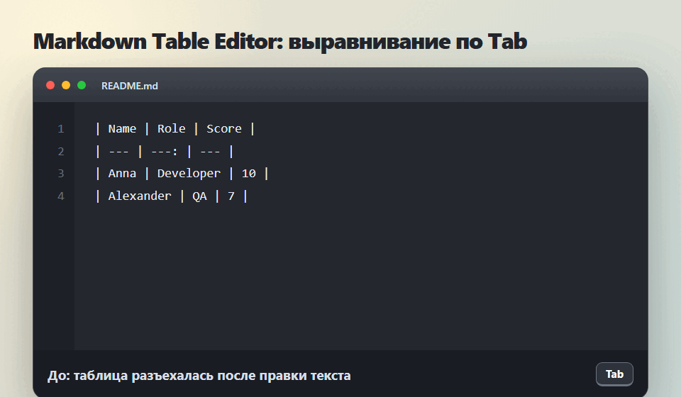

# Markdown Table Editor for IntelliJ IDEA

Плагин для JetBrains IDE, который превращает Markdown-таблицы из ручной боли в быстрый редакторский жест.



## Зачем он нужен

Markdown-таблицы часто живут в `README.md`, changelog, issue-шаблонах, заметках и проектной документации. После пары правок они быстро превращаются в неровный текст: колонки съезжают, числа трудно сравнивать, а руками расставлять пробелы долго и бессмысленно.

Markdown Table Editor делает это прямо в IDE:

- нажмите `Tab` внутри таблицы, чтобы выровнять ее;
- сортируйте строки по текущей колонке;
- вставляйте CSV/TSV и сразу получайте Markdown-таблицу;
- создавайте новую таблицу нужного размера;
- редактируйте строки и столбцы без ухода из файла.

## Возможности

- Выравнивание Markdown pipe-таблицы по `Tab`.
- Обычный `Tab` продолжает работать вне настоящих Markdown-таблиц.
- Переход между ячейками вперед и назад.
- Вставка и удаление строк.
- Вставка и удаление столбцов.
- Перемещение строк и столбцов.
- Сортировка строк по текущей колонке: по возрастанию и по убыванию.
- Конвертация CSV/TSV в Markdown-таблицу из выделения или текущего блока.
- Вставка новой таблицы по размеру, например `3x4`.
- Сохранение выравнивания колонок: left, center, right.

## Установка

1. Скачайте `MarkdownTableEditorIdea-0.4.1.zip` из раздела Releases.
2. Откройте IntelliJ IDEA.
3. Перейдите в `Settings | Plugins`.
4. Нажмите на шестеренку и выберите `Install Plugin from Disk...`.
5. Выберите скачанный ZIP-файл.

Плагин собран как dynamic plugin и рассчитан на установку без перезапуска IDE в совместимых версиях IntelliJ IDEA. Если сама IDE попросит перезапуск, значит платформа обнаружила ограничение загрузки или выгрузки в текущей сессии.

## Локальная сборка

```powershell
.\build.ps1
```

Готовый ZIP появится в папке `build`.

Для прямого копирования в локальную папку plugins:

```powershell
.\install.ps1
```

Важно: `install.ps1` копирует файлы в профиль IDE. Если IntelliJ IDEA уже запущена, для загрузки без перезапуска лучше установить ZIP через `Settings | Plugins | Install Plugin from Disk...`.

## Быстрые сценарии

### Выровнять таблицу

Поставьте курсор внутрь Markdown-таблицы и нажмите `Tab`.

### Отсортировать строки

Поставьте курсор в колонку, по которой нужно сортировать, затем выберите:

- `Tools | Markdown Table Editor | Sort Rows Ascending`
- `Tools | Markdown Table Editor | Sort Rows Descending`

Заголовок и строка-разделитель остаются на месте, сортируются только строки данных.

### Превратить CSV/TSV в Markdown

Выделите CSV или TSV:

```csv
Name,Role,Score
Anna,Developer,10
Bob,QA,7
```

Выполните `Tools | Markdown Table Editor | Convert CSV/TSV to Table`.

Результат:

```markdown
| Name | Role    | Score |
| ---- | --------- | ----- |
| Anna | Developer   | 10    |
| Bob  | QA            | 7     |
```

### Вставить новую таблицу

Выполните `Tools | Markdown Table Editor | Insert New Table` и введите размер в формате `столбцы x строки данных`, например `3x4`.

## Совместимость

Текущая версия ориентирована на IntelliJ IDEA `2026.1.x` и собирается без Gradle, напрямую против локальной установки IntelliJ IDEA.

## Лицензия

Проект распространяется под лицензией MIT. Исходный код доступен на GitHub: `https://github.com/krotname/IdeaMarkdownTableEditor`.
