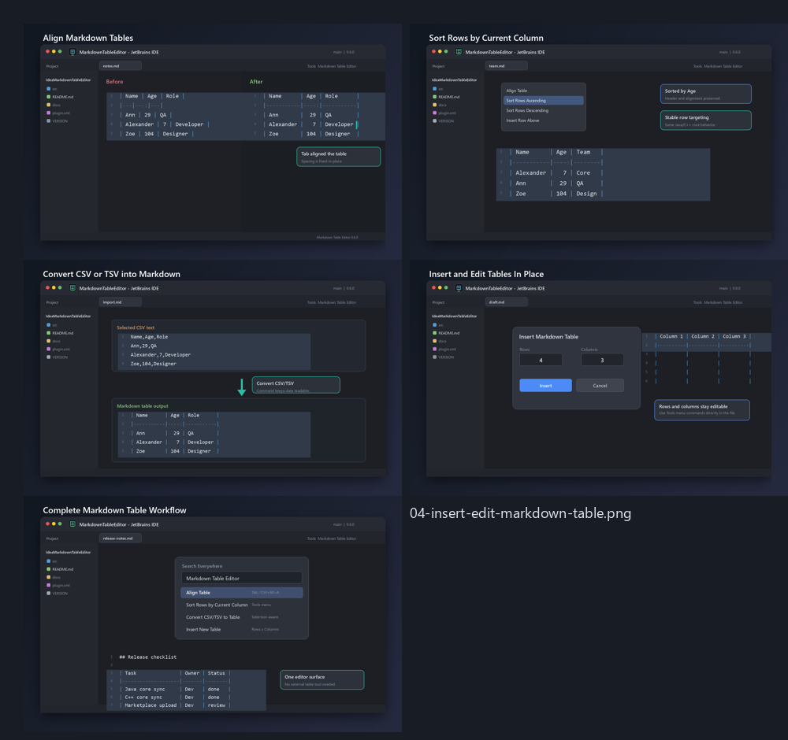

# Markdown Table Editor для JetBrains IDEs

[](https://github.com/krotname/IdeaMarkdownTableEditor/actions/workflows/ci.yml)
[](https://github.com/krotname/IdeaMarkdownTableEditor/actions/workflows/codeql.yml?query=branch%3Amain)
[](https://codecov.io/gh/krotname/IdeaMarkdownTableEditor)
[](https://securityscorecards.dev/viewer/?uri=github.com/krotname/IdeaMarkdownTableEditor)
[](https://www.bestpractices.dev/projects/13153)
[](https://github.com/krotname/IdeaMarkdownTableEditor/releases/latest)
[](LICENSE)
[](https://adoptium.net/)
[](https://plugins.jetbrains.com/plugin/32159-markdown-table-editor)
[](https://plugins.jetbrains.com/plugin/32159-markdown-table-editor)
[](https://markdowntableeditor.krot.name/)

Markdown Table Editor превращает IDE JetBrains на IntelliJ Platform в удобный редактор Markdown-таблиц.
Берёте чужую косую таблицу или сгенерированную ИИ, жмете `Tab`, а плагин выровняет колонки, сохранит Markdown-разметку
и поможет быстро переставлять строки, колонки и данные прямо в IDE.

**Быстрый старт:** [установить из JetBrains Marketplace](https://plugins.jetbrains.com/plugin/32159-markdown-table-editor) ·
[скачать ZIP из последнего релиза](https://github.com/krotname/IdeaMarkdownTableEditor/releases/latest) ·
[открыть сайт проекта](https://markdowntableeditor.krot.name/) ·
[English README](README.en.md)

## Другие версии

- Для Notepad++: [NppMarkdownTableEditor](https://github.com/krotname/NppMarkdownTableEditor)

## Демо


GIF собран из реальных скриншотов IDE JetBrains под Windows: открыт обычный `.md` файл, команда `Align Table` вызвана через `Ctrl+Alt+Shift+1`.



Дополнительные кадры для Marketplace: [выравнивание по Tab](docs/marketplace-screenshots/01-align-table-tab.png),
[сортировка](docs/marketplace-screenshots/02-sort-rows-by-column.png),
[конвертация CSV/TSV](docs/marketplace-screenshots/03-convert-csv-tsv-to-markdown.png),
[вставка таблицы](docs/marketplace-screenshots/04-insert-edit-markdown-table.png),
[команды IDE](docs/marketplace-screenshots/05-complete-workflow-command-palette.png).

## Зачем он нужен

- Не нужно уходить из IDE JetBrains в отдельный Markdown-редактор только ради таблиц.
- Большие pipe-таблицы остаются читаемыми в plain text.
- `Tab`, сортировка и операции со строками/колонками экономят ручное выравнивание.
- CSV/TSV можно быстро превратить в аккуратную Markdown-таблицу.
- Команды доступны из меню `Tools`, контекстного меню редактора и поиска действий IDE.
- Названия команд, диалоги и сообщения локализованы для популярных языков IDE.

## Возможности

- `Tab` внутри Markdown-таблицы выравнивает таблицу.
- Вне Markdown-таблицы `Tab` работает как обычный отступ IDE.
- Выравнивание таблицы вокруг курсора.
- Переход к следующей или предыдущей ячейке.
- Вставка, удаление и перемещение строк.
- Вставка, удаление и перемещение колонок.
- Сужение или расширение текущей колонки на одну экранную позицию.
- Сортировка строк по текущей колонке по возрастанию или убыванию.
- Разовая и автоматическая подгонка ширины Markdown-таблицы под видимую ширину редактора.
- Light автовыравнивание таблицы после правки без изменения ширины.
- Кнопки `Light Автовыравнивание` и `Power Автоподгонка` доступны в левом нижнем углу IDE, в статус-баре; включение Power автоподгонки также включает Light автовыравнивание.
- Конвертация выделенного CSV/TSV-текста или текущего CSV/TSV-блока в Markdown-таблицу.
- Определение CSV/TSV-блока игнорирует запятые внутри кавычек и не захватывает соседний обычный текст.
- Вставка новой таблицы с выбранным числом колонок и строк.
- Сохранение Markdown-маркеров выравнивания: `---`, `:---`, `---:`, `:---:`.
- Корректная обработка escaped pipes: `\|`.
- Оптимизирована работа с большими таблицами; отдельные performance benchmarks входят в CI.

## Установка

Самый короткий путь - установить плагин из JetBrains Marketplace:
https://plugins.jetbrains.com/plugin/32159-markdown-table-editor

Ручная установка из GitHub release:

1. Скачайте ZIP-архив из последнего релиза: https://github.com/krotname/IdeaMarkdownTableEditor/releases/latest
2. Откройте совместимую IDE JetBrains.
3. Перейдите в `Settings | Plugins`.
4. Нажмите на шестеренку и выберите `Install Plugin from Disk...`.
5. Выберите скачанный ZIP-файл.

Плагин собран как dynamic plugin и рассчитан на установку без перезапуска IDE в совместимых версиях продуктов JetBrains. Если сама IDE попросит перезапуск, значит платформа обнаружила ограничение загрузки или выгрузки в текущей сессии.

## Проверка Релиза

Каждый GitHub release публикует plugin ZIP, `MARKETPLACE_SUBMISSION.md`,
`SHA256SUMS.txt`, CycloneDX SBOM и GitHub attestations.

```bash
sha256sum -c SHA256SUMS.txt
gh attestation verify MarkdownTableEditorIdea-*.zip --repo krotname/IdeaMarkdownTableEditor
```

## Совместимость

Плагин собран в bytecode Java 17 и заявляет совместимость с IntelliJ Platform `223+` без верхней границы `until-build`.
Нижняя поддерживаемая линейка IDE JetBrains: `2022.3+`. Это первая линейка IntelliJ Platform, для которой JetBrains указывает Java 17 как runtime платформы.

| IntelliJ Platform | Build branch | Статус                                                             |
| ----------------- | ------------ | ------------------------------------------------------------------ |
| 2022.3            | `223`        | минимальная поддерживаемая версия                                  |
| 2023.1            | `231`        | поддерживается                                                     |
| 2023.2            | `232`        | поддерживается                                                     |
| 2023.3            | `233`        | поддерживается                                                     |
| 2024.1            | `241`        | поддерживается                                                     |
| 2024.2+           | `242+`       | поддерживается за счёт bytecode Java 17 и открытой верхней границы |

Marketplace вычисляет конкретные версии продуктов по `since-build="223"` и зависимости только от `com.intellij.modules.platform`.

| Продукт JetBrains                                           | Минимальная версия по Marketplace |
| ----------------------------------------------------------- | --------------------------------- |
| IntelliJ IDEA Community/Ultimate                            | 2022.3+                           |
| WebStorm, PyCharm, PhpStorm, GoLand, CLion, Rider, RubyMine | 2022.3+                           |
| DataGrip, DataSpell, MPS, AppCode                           | 2022.3+                           |
| Android Studio                                              | Giraffe / 2022.3.1 Beta 1+        |
| RustRover                                                   | 2024.1+                           |
| Gateway, JetBrains Client, Code With Me Guest               | 1.0+                              |

## Публикация

- Страница версий JetBrains Marketplace: https://plugins.jetbrains.com/plugin/32159-markdown-table-editor/edit/versions

## Команды

Команды доступны в меню `Tools > Markdown Table Editor` и в контекстном меню редактора.
Автоматические режимы также переключаются двумя кнопками в левом нижнем углу IDE, в статус-баре.

| Команда                                        | Что делает                                                               |
| ---------------------------------------------- | ------------------------------------------------------------------------ |
| `Tab: Align Markdown Table`                    | Выравнивает таблицу под курсором; вне таблицы работает как обычный `Tab` |
| `Align Table`                                  | Выравнивает текущую Markdown-таблицу                                     |
| `Light Auto Align After Edit`                  | Автоматически выравнивает таблицу после правки без изменения ширины      |
| `Fit Table Width to Editor`                    | Подгоняет текущую таблицу под видимую ширину редактора                   |
| `Power Auto Fit Table Width to Editor`         | Автоматически подгоняет таблицу после правки и изменения ширины редактора; включает Light автовыравнивание |
| `Next Cell` / `Previous Cell`                  | Перемещает курсор между ячейками                                         |
| `Insert Row Below` / `Delete Row`              | Добавляет или удаляет строку                                             |
| `Insert Column Right` / `Delete Column`        | Добавляет или удаляет колонку                                            |
| `Narrow Column` / `Widen Column`               | Сужает или расширяет текущую колонку на одну экранную позицию            |
| `Move Row Up` / `Move Row Down`                | Перемещает текущую строку                                                |
| `Move Column Left` / `Move Column Right`       | Перемещает текущую колонку                                               |
| `Sort Rows Ascending` / `Sort Rows Descending` | Сортирует строки по текущей колонке                                      |
| `Convert CSV/TSV to Table`                     | Превращает выделенный CSV/TSV или текущий блок в Markdown-таблицу        |
| `Insert New Table`                             | Вставляет новую таблицу заданного размера                                |

Например, выделите `Name,Score` и следующую строку `Anna,10` или поставьте курсор внутрь такого блока.
Выполните `Tools > Markdown Table Editor > Convert CSV/TSV to Table`.
Получится Markdown-таблица с колонками `Name` и `Score`.

Горячие клавиши по умолчанию:

Кроме контекстного `Tab`, команды используют `Ctrl+Alt+Shift` с верхним цифровым рядом и соседними клавишами, чтобы не занимать стандартные сочетания JetBrains IDE и Notepad++.

| Команда                     | Сочетание           |
| --------------------------- | ------------------- |
| `Tab: Align Markdown Table` | `Tab`               |
| `Align Table`               | `Ctrl+Alt+Shift+1`  |
| `Light Auto Align After Edit` | `Ctrl+Alt+Shift+A` |
| `Fit Table Width to Editor` | `Ctrl+Alt+Shift+W`  |
| `Power Auto Fit Table Width to Editor` | `Ctrl+Alt+Shift+F` |
| `Next Cell`                 | `Ctrl+Alt+Shift+2`  |
| `Previous Cell`             | `Ctrl+Alt+Shift+3`  |
| `Insert Row Below`          | `Ctrl+Alt+Shift+4`  |
| `Delete Row`                | `Ctrl+Alt+Shift+5`  |
| `Insert Column Right`       | `Ctrl+Alt+Shift+6`  |
| `Delete Column`             | `Ctrl+Alt+Shift+7`  |
| `Narrow Column`             | `Ctrl+Alt+Shift+,`  |
| `Widen Column`              | `Ctrl+Alt+Shift+.`  |
| `Move Row Up`               | `Ctrl+Alt+Shift+8`  |
| `Move Row Down`             | `Ctrl+Alt+Shift+9`  |
| `Move Column Left`          | `Ctrl+Alt+Shift+[`  |
| `Move Column Right`         | `Ctrl+Alt+Shift+]`  |
| `Sort Rows Ascending`       | `Ctrl+Alt+Shift+=`  |
| `Sort Rows Descending`      | `Ctrl+Alt+Shift+-`  |
| `Convert CSV/TSV to Table`  | `Ctrl+Alt+Shift+0`  |
| `Insert New Table`          | `Ctrl+Alt+Shift+\`  |

Сочетания можно изменить в `Settings | Keymap`.

## Сборка и тесты

Нужен JDK 17. IntelliJ Platform SDK `2022.3` для сборки скачивается Gradle IntelliJ Platform plugin.

```cmd
.\gradlew.bat check buildPlugin
```

Готовый ZIP появится в папке `build/distributions`.
Если локально установлена IDE JetBrains и не хочется ждать скачивания платформы, можно передать путь:

```cmd
.\gradlew.bat check buildPlugin -PplatformLocalPath="C:\Program Files\JetBrains\IntelliJ IDEA 2026.1.3"
```

Для Marketplace-проверки совместимости:

```cmd
.\gradlew.bat verifyPlugin
```

В GitHub Actions verifier дополнительно берет recommended IDEs. Локально это можно включить явно:

```cmd
.\gradlew.bat verifyPlugin -PverifyRecommendedIdes=true
```

Для отчета покрытия JaCoCo:

```cmd
.\gradlew.bat jacocoTestReport
```

HTML-отчет появится в `build/reports/coverage/html`.

Performance benchmarks ядра:

```cmd
.\gradlew.bat corePerformance
```

Полный релизный build:

```cmd
.\gradlew.bat clean check verifyPlugin buildPlugin
```

Для явной релизной версии передайте Gradle property; без нее Gradle читает `VERSION`.
`plugin.xml` и Marketplace-документ генерируются из этого же значения, а готовый Marketplace-файл появляется в `build/release/MARKETPLACE_SUBMISSION.md`.

```cmd
.\gradlew.bat clean check verifyPlugin buildPlugin "-PpluginVersion=x.y.z"
```

Для быстрой локальной сборки без Plugin Verifier:

```cmd
.\gradlew.bat clean check buildPlugin
```

Для локальной установки используйте готовый ZIP из `build/distributions` через `Settings | Plugins | Install Plugin from Disk...`.
